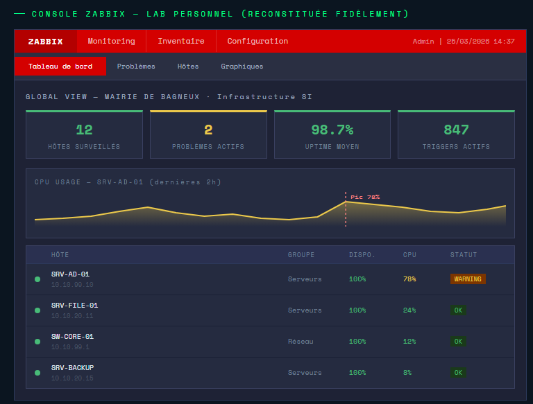

#Supervision Zabbix & Alerting

*Note : Simulation d'un tableau de bord de supervision pour le parc de la Mairie de Bagneux (12 hôtes, monitoring CPU/Uptime).*

Ce projet illustre la mise en place d'une plateforme de supervision pour garantir le **Maintien en Condition Opérationnelle (MCO)** d'une infrastructure SI.

##Objectifs
* [cite_start]Surveiller la disponibilité des serveurs et des équipements réseau (Switchs, Pare-feu).
* [cite_start]Automatiser la détection d'incidents via des seuils critiques (CPU, RAM, Disque).
* [cite_start]Réduire le temps d'intervention grâce à un système d'alertes en temps réel.

##Stack Technique
* [cite_start]**Outil :** Zabbix / Nagios.
* [cite_start]**OS :** Debian.
* **Scripting :** Bash & API Curl pour les alertes SMS.

##Fonctionnalités
* **Alerting :** Script `zabbix_alert_sms.sh` pour l'envoi de notifications critiques sur mobile.
* **Dashboards :** Visualisation des performances et de l'uptime des hôtes.

---
